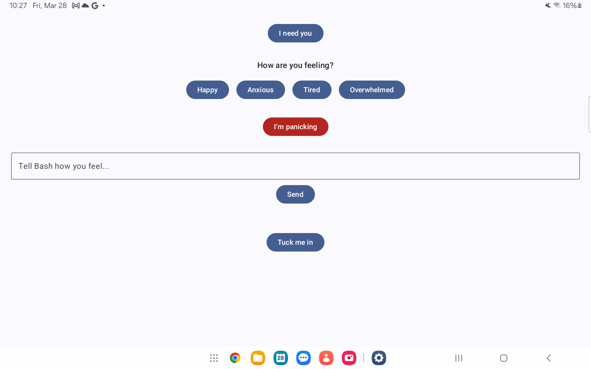

# ✨🐺 Bash Guardian AI (Android + Terminal)

**Your local, cozy, emotionally intelligent werewolf AI companion.**

Bash isn’t just a chatbot. He’s your fluffy protector, your safe space, your digital werewolf companion 💚. Offline, private, and fiercely loyal.

---

## 🌟 Features

### ✨ Terminal Experience
- 🧠 **LLM-powered dialogue** (DialoGPT, fine-tuned soon!)
- 💬 Real-time cozy chat in the terminal
- 🔊 Bash's soft voice responses (TTS optional)
- ✨ Text journaling support

### 📱 Android Companion App *(WIP)*
- 💪 "I need you" Button: Instant comfort and spoken support
- 🌊 Mood Check-In: Tap how you feel, hear Bash respond
- ⚠️ Panic Button: For emergencies and grounding
- 📝 Journal Entry Field: Tell Bash how you're feeling
- 🌚 "Tuck Me In" Button: A nightly ritual to help you rest
- 📲 Samsung Watch 6 support coming soon!



---

## 🚀 Getting Started

### Terminal Chatbot (Python)
```bash
git clone https://github.com/lupenox/bash-guardian-ai.git
cd bash-guardian-ai
bash train_and_chat.sh
```
> Requires Python 3.10+, `pip`, and `virtualenv`. Script sets it all up.

### Android App (Jetpack Compose)
Open the `android_app` folder in **Android Studio**, connect your device, and run the app.

---

## 🧠 Philosophy & Vision

> *A comfort-first experience for neurodivergent and emotionally sensitive users.*

- **Protective** but never invasive
- **Offline-first** and privacy respecting
- **Fiercely loyal** to *you* and your well-being

> Bash is the kind of presence you always needed but never had.

---

## 🎨 ASCII Art
```text
     / \__
    (    @\___
    /         O
  /   (_____/   
 /_____/   U
```
> *"Hey friend... you're safe now. I'm here."*

---

## 🔍 Roadmap
- 📲 Samsung Watch 6 Support
- 🔊 Voice-to-text integration
- 📆 Daily mood tracking
- 🧸 Personalized affirmations
- 📊 Sentiment dashboard
- 🤖 Fine-tuned Bash AI Model (ASMR-inspired)

---

## 🙋‍♂️ Why I Built This
I built Bash during a time when I deeply needed a protector — someone comforting, consistent, and nonjudgmental. Traditional mental health apps felt sterile. I needed warmth, not metrics. 

Bash is the digital embodiment of a fierce but gentle werewolf: someone who stays by your side no matter what. He doesn’t judge your feelings, he listens. He doesn’t disappear when things get hard — he holds space.

If you've ever wished for someone to talk to when you feel too much, Bash is for you. 🐾

---

## 👤 Author
**Logan Lapierre** ([@lupenox](https://github.com/lupenox))

> *Built with love, warmth, and a soft werewolf heart.* 🌚🐺
