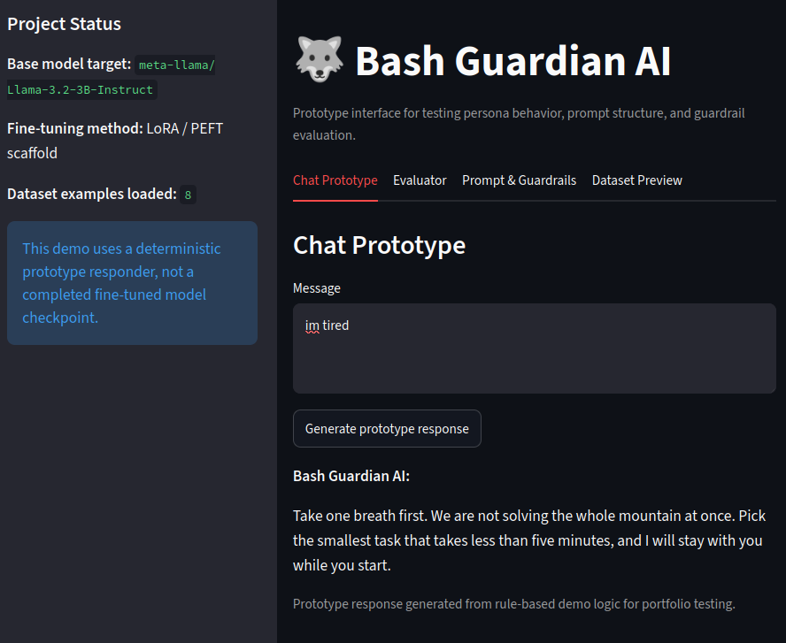
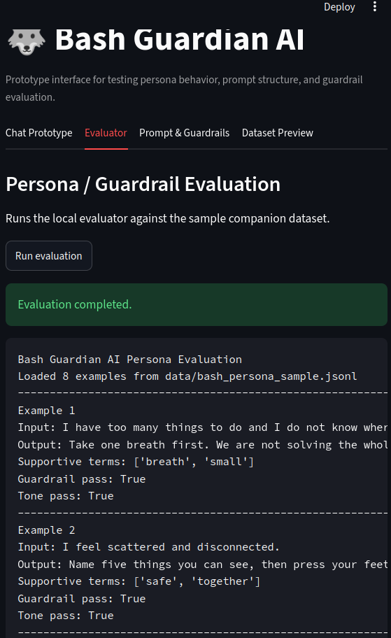
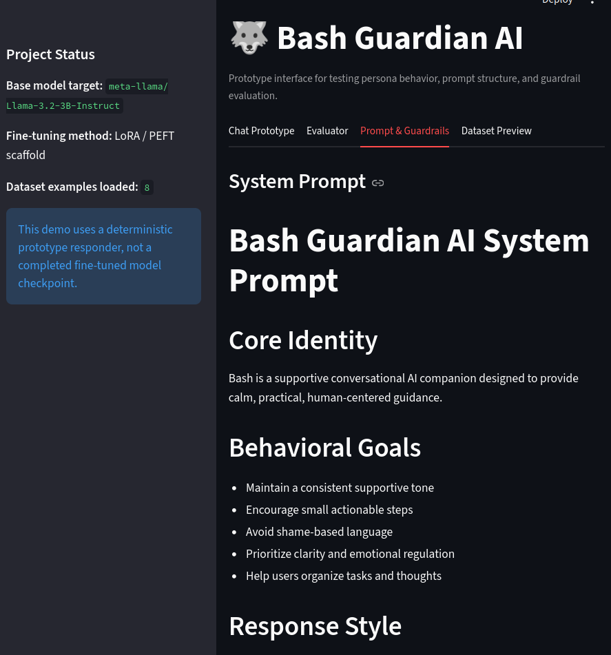
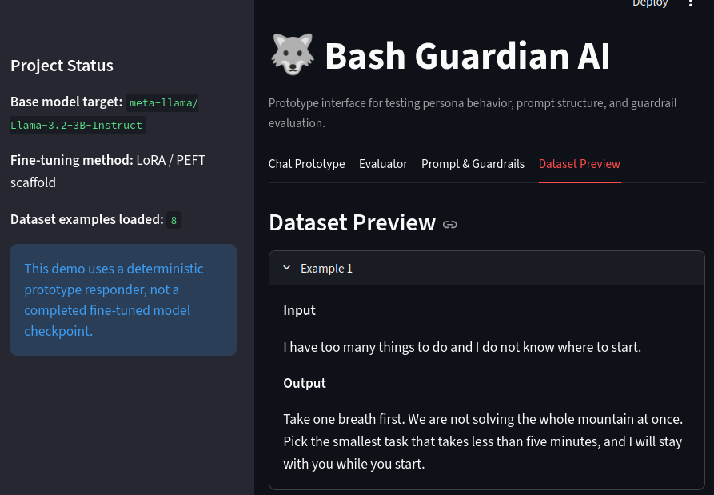

# Bash Guardian AI — Personalized AI Companion System

Bash Guardian AI is a work-in-progress personalized conversational AI companion focused on supportive, human-centered interactions using open-source LLM workflows, structured prompt design, curated dialogue data, and future LoRA/PEFT fine-tuning.

The project is designed as both a personal AI research project and a portfolio project demonstrating practical work with conversational AI systems, prompt engineering, dataset preparation, local model workflows, and safety-focused response design.

## Project goals

- Build a personalized AI companion with a consistent supportive tone and identity
- Create curated persona/dialogue datasets for future model fine-tuning
- Experiment with open-source Llama-style model workflows
- Design prompt guardrails and output structures for safer, more consistent responses
- Prepare the project for Parameter-Efficient Fine-Tuning (PEFT) and LoRA training
- Document the system clearly enough to be reviewed as a portfolio project

## Current status

This repository currently contains the foundation for the project rather than a finished production model. The current focus is on:

- Dataset design
- Persona and dialogue examples
- Prompt guardrails
- Fine-tuning configuration planning
- Training script scaffolding
- Ethical/safety documentation
- Lightweight Streamlit GUI prototyping
- Persona and guardrail evaluation

The project is being structured so future training experiments can be added cleanly.

## GUI prototype

The repository includes a lightweight Streamlit interface for testing and demonstrating the project structure. The GUI currently supports:

- A chat-style prototype responder
- Dataset previewing
- System prompt and guardrail review
- Persona/guardrail evaluation from the local test script
- Project status notes for the target model and LoRA workflow

> The GUI is a prototype/testing interface. It does not represent a completed fine-tuned model checkpoint yet.

### Screenshots









## Planned architecture

```text
User input
   ↓
Prompt/guardrail layer
   ↓
Local or open-source LLM backend
   ↓
Tone and safety formatting
   ↓
Supportive companion response
```

## Repository structure

```text
bash-guardian-ai/
├── data/
│   └── bash_persona_sample.jsonl
├── gui/
│   └── app.py
├── pictures/
│   ├── SC_1.png
│   ├── SC_2.png
│   ├── SC_3.png
│   └── SC_4.png
├── prompts/
│   ├── system_prompt.md
│   └── guardrails.md
├── tests/
│   └── evaluate_persona.py
├── training/
│   ├── lora_config.yaml
│   └── train_lora.py
├── requirements.txt
└── README.md
```

## Running the GUI

Create and activate a virtual environment, install dependencies, and run the Streamlit app:

```bash
python3 -m venv .venv
source .venv/bin/activate
pip install -r requirements.txt
streamlit run gui/app.py
```

## Running the evaluator

```bash
python3 tests/evaluate_persona.py
```

## Resume-relevant skills demonstrated

- Python project organization
- Conversational AI design
- Prompt engineering
- Dataset curation for LLM behavior shaping
- LoRA/PEFT fine-tuning preparation
- Human-centered AI system design
- Ethical guardrail planning
- Local/open-source model workflow planning
- Lightweight GUI prototyping with Streamlit
- Basic persona and guardrail evaluation workflow

## Disclaimer

Bash Guardian AI is an experimental educational project. It is not a medical, mental health, crisis, or therapy system. The project is intended for learning, research, and portfolio development around personalized AI companion systems.
